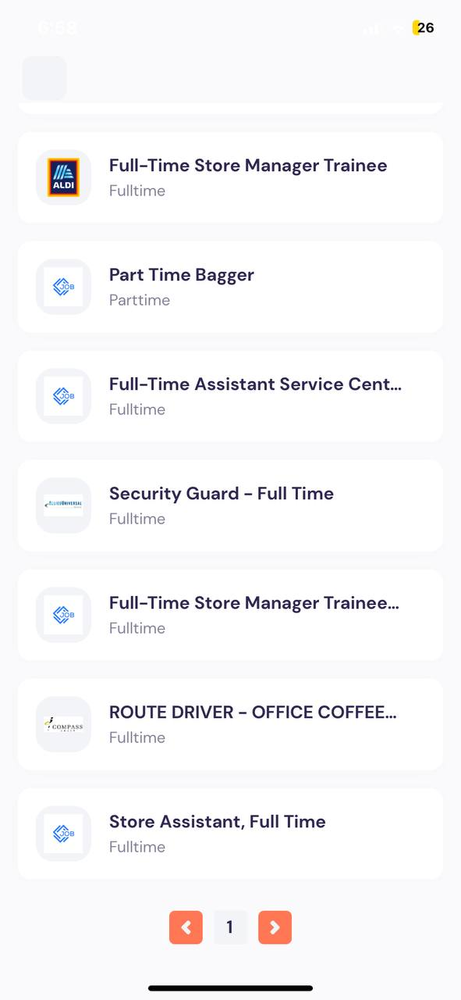

# React Native Jobs App

This is a simple phone application practice built with React Native. It helps users find jobs using the jSearch API. The app features a search bar, popular jobs, and nearby jobs on the home screen. Users can filter their job search by full-time, part-time, or contractor positions, or use the search bar to find more jobs.

## Demo

Try out the app using Expo Go: [App on Expo](https://expo.dev/@0gw0/react-native-jobs?serviceType=classic&distribution=expo-go)

## Features

- Home screen with a search bar, popular jobs, and nearby jobs
- Job details page with information about the job, qualifications, and responsibilities
- Clicking on "Apply for Job" redirects users to the original job website posting
- Job search using search bar
- Job search filtering by full-time, part-time, or contractor positions

## Built With

- [React Native](https://reactnative.dev/)
- [jSearch API](https://rapidapi.com/letscrape-6bRBa3QguO5/api/jsearch/details)

## Screenshots

### Job Details & Apply for Job

| Job Details                                     | Apply for Job                                  |
| ----------------------------------------------- | ---------------------------------------------- |
|  |  |

### Search

| Search Bar                                        | Search Results                                   |
| ------------------------------------------------- | ------------------------------------------------ |
|  |  |

### Full-time Listings

